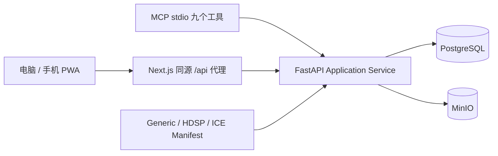

# Research Hub v0.1 架构

科研事实由本机服务保存：PostgreSQL 保存用户、关系、参数来源、指标、工作流与审计；MinIO 保存 Artifact 字节。浏览器、手机和 MCP 使用同一个 Application API，ChatGPT Memory 不参与持久化。

Core 负责项目与科研实体；Workflow Engine 负责 Stage/Gate、状态与 Schema 校验；Project Module 以 manifest 定义领域语义。HDSP 参数不进入通用实体固定列，Generic 不带超声字段。

默认 Compose 只向 `127.0.0.1:3000` 暴露 Web。API、PostgreSQL、MinIO 仅在 Compose 内部网络；开发端口需要显式 dev override。LAN override 由 Caddy 提供 HTTPS，必须由用户信任本地 CA，不自动开放公网或配置路由器。

密码哈希与不透明会话属于 API；Cookie 写操作要求 CSRF；MCP Bearer Token 由已登录用户签发，数据库只存摘要与 scopes/actor_type。每次操作仍经过对象所有权验证，写操作记录 AuditLog。没有任意 SQL、shell 或服务器文件工具。

`postgres_data`、`minio_data` 是命名持久卷。容器重建不删除卷；`docker compose down -v` 会删除科研数据，不能作为普通停止命令。备份使用数据库逻辑 dump 与对象逻辑导出，可迁移到另一台兼容服务主机。

未来 Desktop Agent 仅通过任务 API 获取明确授权工作，并回传 Run/Metrics/Artifact；v0.1 没有远程执行、MATLAB、COMSOL 或仪器控制。
