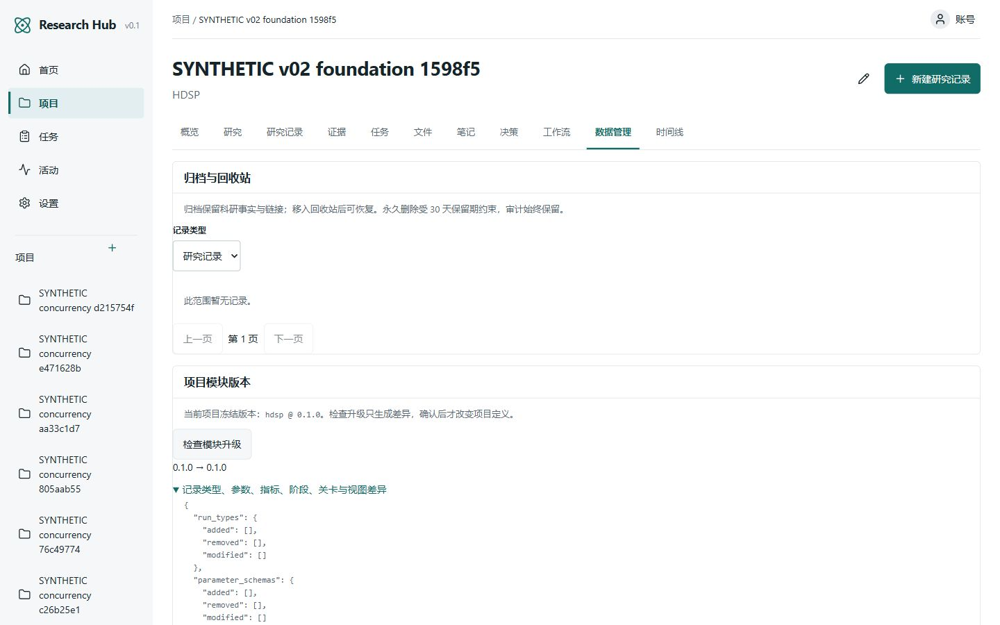
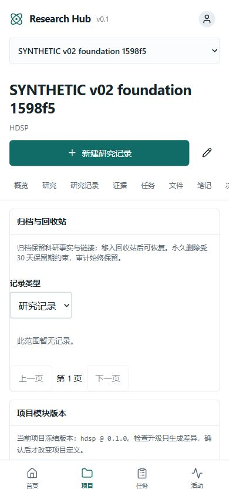

# v0.2 Sprint 0 交付记录

日期：2026-10-06。基线 RH-003，开发分支 `codex/researchhub-v0.2`。本文件仅描述基础迭代，不代表完整 v0.2 验收。

## IMPLEMENTED

项目持有冻结模块版本与快照；0002 直接包含已部署 v0.1 定义，迁移不读取当前安装的 manifest，0001 不变。升级提供结构差异、人工确认、目标摘要和版本冲突检查，并拒绝破坏既有 Run/Metric/Stage/Gate 定义。

共享服务实施 Human/AI 科研权限边界。AI 可保存过程与未确认记录，Evidence/Decision 仅 proposed；不能填写人工结论、确认参数、创建 validated/reproduced 指标、修改人工审阅记录或已通过 Gate、执行生命周期管理。授权在输入解析后复查，防止布尔类型转换绕过。

核心对象归档与回收站独立于科研状态；软删除保留链接与文件，30 天保留期后才允许人工永久删除。PostgreSQL/SQLite 保护 Audit 的 UPDATE/DELETE。对象删除 outbox 不引用已删除项目的外键，支持失败重试、owner 范围与活动文件引用检查；上传成功但响应丢失也登记清理意图，不扫描或随意清空桶。

普通写入、生命周期与升级按 Project→Run→Resource 获取锁，等待后刷新对象再判定权限与生命周期。安全取舍是同一项目写入串行化。中文数据管理能选择并恢复所有受支持对象；项目移入回收站必须输入名称确认。

CI 包含后端/MCP 单元测试、PostgreSQL 离线迁移 SQL、前端测试、类型与生产构建。Compose QA 使用独立数据库、桶、命名卷和 localhost 3300/38000/35432/39000 端口；随机凭据与测试运行记录只在忽略的 storage 和 .env.qa。

## TESTED

| 证据 | 实际结果 |
|---|---|
| 后端和 MCP 隔离回归 | 71 passed；不等同于实际服务验收 |
| 前端交互测试 | 21 passed；TypeScript 和本机/容器生产构建通过 |
| Docker 四服务 | 实际构建并健康启动，使用 PostgreSQL 与 MinIO |
| 实际 API、文件、MCP 协议、PG 并发 | 15 passed；全部 SYNTHETIC QA 数据 |
| PostgreSQL 并发 | 三项测试观察到真实行锁等待；旧对象缓存重读后分别拒绝 AI 改已确认参数、删除已恢复 Run、创建已移除的类型 |
| 容器重启持久化 | 1 passed；重启全部四服务后读取记录和文件 SHA256 |
| Compose 备份恢复 | 1 passed；停止 API/Web 写入，恢复至全新数据库和桶，比较全部表行数及文件 SHA256 |
| 个人迁移 | 备份在 `storage/backups/v01-baseline-20261006-135908/`；29 原表、47 原行的全部原始列逐行保留 |
| 个人电脑服务入口 | 迁移后恢复 localhost:3000，`open-hub.ps1 -NoBrowser` 幂等检查通过 |
| 浏览器 | 实际 Run 归档→数据管理显示→恢复→列表重现；升级预览无写入；390px 视口 scrollWidth=clientWidth=390 |
| 代码审查 | 独立规格/质量两阶段审查，五类发现修复后复审通过 |
| 仓库隐私 | 使用既有 GCM 凭据只读 API 确认 private=true；用户明确选择保持私有 |

截图为隔离 QA，无个人科研内容：

## NOT VERIFIED

实际 Codex 客户端和 ChatGPT 的连接尚未执行；现有 MCP 测试仅证明 SDK/stdio/API 链路。实体手机/平板访问、相机权限与 PWA 安装尚未测试。远程 CI 必须在本迭代推送后查看对应 SHA 的结果，不能以本地检查替代。

## NOT IMPLEMENTED

本阶段尚未实现 Sprint 1–3 的 Capability、快捷创建/克隆/星标、分页检索与标签、Activity 展示隐藏与独立 Audit 界面、项目导出/Bundle 导入、谱系/追踪/历史、Registry 驱动视图、完整 MCP 与 GitHub 来源字段。永久删除和对象清理目前只有人工 API；后续补齐中文确认界面。

## 已知限制

项目级锁适合当前个人工作区，但会降低同项目并发写吞吐。Audit 为科研历史，永久删除科研对象也不删除 Audit 中的历史快照。对象上传与数据库是两种事务，无法做到跨系统原子提交；outbox 和活动引用重查用于恢复一致性。

pytest 有 Starlette/httpx 与 MCP/Pydantic 两项依赖警告；Vitest 的 Vite 配置扩展名提示仍存在。npm 安装后审计报告 0 个漏洞。本轮不运行 MATLAB/COMSOL/Verasonics 或实体设备。
