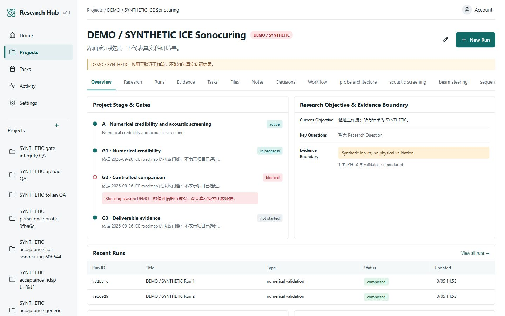
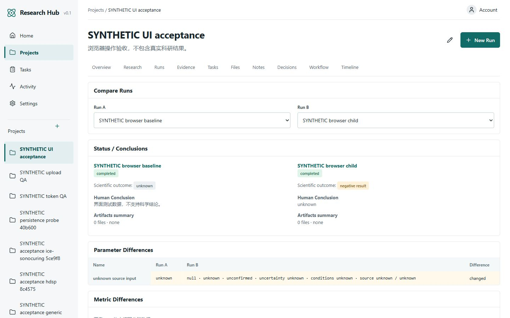
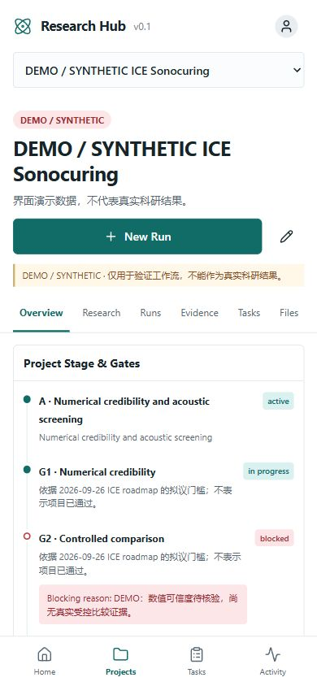
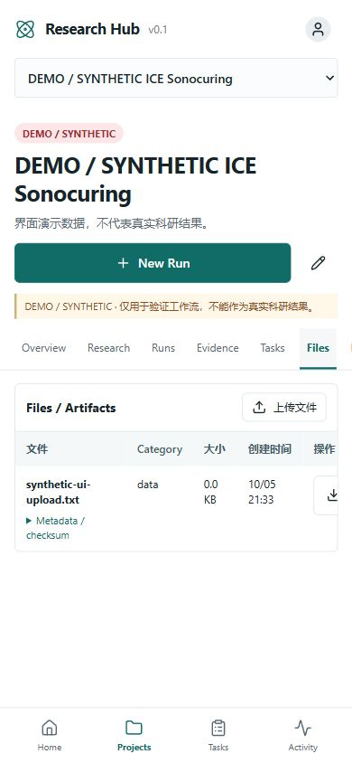
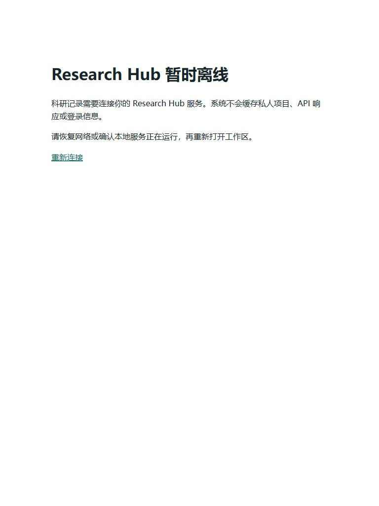

# Research Hub v0.1 实现与验收报告

日期：2026-10-05；工作目录：`H:\ResearchHub`。代码分支：`codex/researchhub-v0.1`。本报告区分 IMPLEMENTED、TESTED、NOT VERIFIED、NOT IMPLEMENTED；实现存在不等于完整验收通过。

## 1. 系统架构

Next.js/React/TypeScript 提供桌面与手机工作面，同源 `/api` 代理连接 FastAPI。SQLAlchemy/Alembic 管理 PostgreSQL；Artifact 字节存储于私有 MinIO/S3，元数据、关系与 SHA256 存储于数据库。三种 manifest 驱动 Module 语义；Web 与本地 stdio MCP 复用 Application Service、授权与审计。

## 2. 实际实现功能 — IMPLEMENTED

登录与首次账户创建；项目所有权、CSRF、不透明 HttpOnly 会话；只读/写 Token 及撤销；Core CRUD；父子 Run、变化与双 Run 对比；参数来源、unknown/null、确认状态；Metrics；Artifact 上传和授权下载；Evidence 与 Claim 多对多关联；Task/Milestone；Note/Decision/Risk；Stage/Gate/Criteria；审计 before/after；主动 DEMO seed。科学结果与执行状态、AI 分析与人工结论分开保存。

模块 Schema 预设只填写名称、类型、单位，不猜测真实频率、材料阈值或设备参数。Stage/Gate 的拟议门槛保留来源，模拟证据不被表述为物理验证。审计 actor_type 来源于已签发身份，普通 Web 请求不能通过任意 header 冒充 MCP。

## 3. Repository Tree

```text
apps/
  api/researchhub/        FastAPI、模型、Schema、服务、认证、S3、请求体限制
  web/src/               Next.js 页面、Shell、表单、领域视图、Run 比较
  web/public/            PWA manifest、图标、service worker、离线页
  mcp/                   九个 stdio 工具与受限 API 适配器
packages/
  project-modules/       generic / hdsp / ice-sonocuring manifest
  schemas/               Core JSON Schema 与 Module Schema
  shared/                TypeScript 共享类型
infrastructure/
  migrations/            Alembic 冻结初始迁移
  docker/                API / Web / MinIO Dockerfile
  caddy/                 LAN HTTPS 配置
scripts/                 setup/start/stop、备份/恢复、原生验收辅助脚本
tests/                   backend、MCP、integration
docs/                    必要设计、存储、模块、MCP 与验收文档
storage/                 被 Git 忽略的数据库、文件、凭据、日志、备份
```

## 4. Database Tables

SQLAlchemy metadata 实际为 **29 张应用表**，另有迁移建立的 `alembic_version`。

| 类别 | 表 |
|---|---|
| 账户与认证 | users, sessions, api_tokens |
| 科研 Core | projects, research_questions, hypotheses, milestones, tasks, research_runs, parameters, metrics, artifacts, evidence, claims, sources, notes, decisions, risks, tags, audit_logs |
| 工作流 | stage_gates, gate_criteria |
| 外键关联 | claims_evidence_ids, claims_run_ids, claims_artifact_ids, claims_source_ids, decisions_evidence_ids, stage_gates_evidence_ids, gate_criteria_evidence_ids |

## 5. 三模块区别

| Module | 领域与视图 |
|---|---|
| Generic | 通用问题—设计—执行—分析—复核；不带超声固定字段 |
| HDSP | 固定目标面表面打印；相位检索、相位板、声场、Z-scan、热、固化；IoU、能量效率、过/欠固化等实际指标 |
| ICE | A–E、G0–G5、数值可信度/受控比较/可交付证据/制造水槽评审/phantom；13 个领域入口按 Run 类型筛选关联证据与文件 |

ICE 路线图来自用户指定本地文件；没有导入其历史结果成为当前项目事实。HDSP 当前厚度相位板不被称为严格 acoustic metalens。

## 6. UI Design System

白色工作面、浅灰导航、低饱和 teal 动作色；系统字体与 monospace 数值；4/8px 间距、6px 圆角、1px 分隔线；列表/表格优先。44px 触摸目标、键盘焦点、原生 dialog、可见错误与真实 loading/empty。桌面左 rail，手机顶部项目选择与底部四项导航。DEMO/SYNTHETIC 持续可见。

概念图：[researchhub-concept.png](researchhub-concept.png)。实际页面保留了左侧导航、科研状态列表、证据边界与低饱和 teal；最终依据真实字段组织信息，不复制概念图里的虚构数值。二轮修正包括移动导航、表格独立滚动、表单状态选项、日期转换、最近记录排序与 Gate 判据编辑约束。

## 7. Desktop 检查 — TESTED

实际生产 Web + FastAPI + PostgreSQL/MinIO，1440×900 浏览器检查 Home、Generic、HDSP、ICE Overview、Run Detail、Compare、Evidence、Tasks、Artifacts。创建项目、父子 Run、unknown/null 参数、科研负结果、独立人工结论均经过真实页面操作；上传结果能显示数据库元数据与下载链接。页面宽度未超过视口。




## 8. Mobile / Tablet 检查 — TESTED（浏览器视口）

390×844 检查项目选择、Stage/Gate、任务更新、Note 创建、Run 创建、最近 Run、参数/指标与文件上传；创建记录保存到真实数据库。Files 页 document scrollWidth=390，宽表格在自己的区域滚动。768×1024 平板文件页也已检查。手机顶部选择器与底部四项导航代替桌面 rail。



其他证据：[任务更新](screenshots/mobile-task.jpg)、[创建 Note](screenshots/mobile-note.jpg)、[创建 Run](screenshots/mobile-runs.jpg)、[平板文件页](screenshots/tablet-files.jpg)。这些是桌面浏览器的响应式验收；实体手机拍照、LAN HTTPS 访问与安装仍为 NOT VERIFIED。

## 9. PWA

IMPLEMENTED：manifest、192/512 PNG 图标、service worker、安装提示和静态离线页。TESTED：真实 localhost 安全上下文注册、worker ready；停止 API/Web 后重新加载显示静态离线说明。三个测试验证 API/写请求不进入 worker 缓存、导航断网回退与图标真实尺寸。科研 API、会话和已登录页面不写入缓存；离线编辑 NOT IMPLEMENTED。


安装到操作系统 / 实体手机为 NOT VERIFIED：当前内置浏览器没有发出安装事件，不能把 worker 注册成功说成已经安装。见[安装设置页面](screenshots/pwa-settings.jpg)。

## 10. MCP

IMPLEMENTED：官方 SDK 的 stdio 服务、九个 read/write 工具、安全 UUID 检查、Token 范围与审计。TESTED：真正的 stdio ClientSession initialize/list/call，经过 HTTP API 的 read/write/scopes 测试；另有两项真实 PostgreSQL API 协议验收，确认只读 Token 写入返回 403，写 Token 保存 Note 且审计为 codex，结束撤销临时 Token。外部 ChatGPT/Codex 连接：**EXTERNAL INTEGRATION NOT VERIFIED**；远程 HTTPS/OAuth MCP NOT IMPLEMENTED。

## 11. Tests

| 验证 | 实际结果 | 边界 |
|---|---|---|
| 后端 + MCP 隔离测试 | 40 passed | 隔离 SQLite / 对象适配器；不替代实际服务 |
| 前端 | 18 passed | 包含 PWA 缓存策略与图标检查 |
| 真实 PostgreSQL / MinIO 业务集成 | 8 passed | 三模块、完整科研流程、SHA256 下载、权限、上传、DEMO、证据失效联动 |
| 真实 API 的 MCP stdio | 2 passed | 读写范围、codex 审计 |
| 实际服务重启持久化 | 1 passed | PostgreSQL、MinIO、API、Web 停止重启后读取 Run/文件/审计 |
| 静止 QA 数据备份恢复演练 | 1 passed | pg_dump/pg_restore + 全部 S3 对象；新空数据库/桶，29 表行数与文件 SHA256 一致 |

上述共 **70 项** 自动检查分环境执行，不声称是一次 Compose 验收。Next.js production build、Ruff、pip check、全部 PowerShell 脚本语法、Compose 基础/dev/LAN config、Alembic offline SQL 均已执行通过；真实 PostgreSQL 初始迁移建立 29 张应用表。

Windows 沙箱拒绝了前端 esbuild 与 MCP 子进程/命名管道启动；在授权的沙箱外重跑通过，未将环境拒绝解释为测试通过。Docker 完整构建启动仍为 NOT VERIFIED。
- 上游警告：Starlette TestClient/httpx 弃用提示；MCP/Pydantic lifespan forward reference。测试通过不代表这些依赖警告已解决。

## 12–14. 未验证、已知问题与 Technical Debt

当前 Windows 已安装 Docker Desktop/WSL，已启用 Virtual Machine Platform 与 WSL 可选组件；系统要求重启，Docker Linux 引擎尚未运行。没有自动重启。因此容器构建、容器网络、命名卷重启、Caddy LAN HTTPS、真机 PWA 与 Compose PowerShell 备份恢复封装尚未验收。原生真实 PostgreSQL17.11/MinIO 辅助验收已通过，但不替代 Docker 验收。按用户最终标准，本版**尚未完整验收完成**。

交付使用独立的 `researchhub` 数据库/bucket，保留首次账户创建；所有 QA 记录在独立 `researchhub_qa` 数据库/bucket，均为 SYNTHETIC。原生启动方法见 README；只监听 localhost，暂不提供实体手机访问。

已切换个人数据环境并实际打开[首次注册页面](screenshots/first-setup.jpg)。最终后端/MCP + 真实业务/MCP 联测为 50 passed，前端 18 passed；另两项重启和恢复演练单独执行。生产构建曾因运行中的 standalone Web 占用目录失败，停止其进程后重跑成功，再从最终构建启动个人环境。

登录限流为单进程内存实现；Activity 暂取最近 200 条，项目审计最近 100 条，集合缺分页；标签实体可 API CRUD，标签关联与页面管理未实现；删除关联记录后可能存在对象存储孤立文件，缺垃圾回收。完整历史回滚、在线备份/PITR、任务协作/通知、计算任务执行、仪器控制和本地文件自动导入未实现。

## 15. 下一版最建议的五项功能

1. Docker/真机 HTTPS/PWA 验收、Compose 恢复封装演练与 CI。
2. 搜索、过滤、分页及标签关联。
3. 实验结果导入与项目 GitHub Commit/Issue/PR 进度。
4. 参数/证据版本历史与 Gate 失效影响视图。
5. 外部 ChatGPT/Codex MCP 连接验证与最小范围 HTTPS/OAuth。
