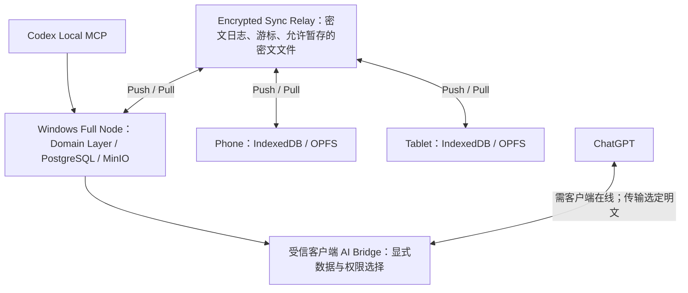

# Research Hub v0.3：Local-first 同步架构

状态：**DECIDED（Sprint 0 推荐设计，待人工批准）**。隔离机制验证见原型；生产同步 **NOT IMPLEMENTED**。需求原文见 [SPRINT_0_REQUIREMENTS.txt](SPRINT_0_REQUIREMENTS.txt)，覆盖索引见 [SPRINT_0_REPORT.md](SPRINT_0_REPORT.md)。稳定产品为 [v0.2.0](https://github.com/Zh9426/ResearchHub/releases/tag/v0.2.0)。

## 拓扑与边界

Windows 保留现有存储、备份、研究软件和 Codex 执行位置。Primary 是完整存储职责，不是合并权重。手机和平板各自保存选中项目的本地科研状态与待发送日志；离线可创建 Run/Note/Task、记录参数候选和 AI proposal。网络恢复后发送业务变化，不要求电脑始终在线。暂不打包移动端或安装后台服务。

Relay 没有研究内容的解密密钥，不是科研真值数据库。它验证设备成员资格、外层消息签名、配额、父版本引用和批次完整性；内容及 Human 权限在受信客户端再次验证。接收密文不等于认可科学结论。恶意 Relay 可以阻断或隐藏消息；签名、哈希及已锚定游标可检测部分篡改，不能保证服务器诚实或可用。

三种“成功”严格分开：本地事务成功（本机已保存）、Relay durable ACK（已暂存）、Replica domain accepted（已通过业务规则并入本地状态）。另有 conflict-stored/quarantined。UI 分别显示“本机待同步”“Relay 已接收”“已应用”“冲突待审查”，不能在 ACK 后宣称全设备一致。

## v0.2 业务映射

未来 PC 的每个 Domain mutation 必须在**同一个 PostgreSQL 事务**内提交对象变化、不可变业务 ChangeSet、Audit 与 Outbox；API 和 Codex 的服务层使用同一入口，保留现有 Human/AI 校验。不得靠事后轮询行变更补日志。MinIO 文件写入无法加入 PG 事务，采用临时上传、校验、元数据提交及可恢复的文件状态；未完成文件不能被标为可用。

项目保留冻结 module_snapshot；Run 的 Parent/Child 和来源属于业务数据，参数、指标、Evidence、Gate、Decision 依赖 Run 与项目版本。并发创建独立 Child Run 是合法研究分支。冲突是同一业务对象版本分叉，AI Review 是来源与权限审查，二者分别建模，不能共用“接受 AI”动作绕过冲突或人工确认。

每个用户动作组成一个 SyncTransaction。并发科学值保留不可变候选，不用时间戳、服务器顺序、Primary 或 AI 置信度选胜者。设备最终收敛到相同 DAG head 集合；存在多个 head 时仍为冲突，收敛不意味着自动得到单一科学值。

## 本轮实现范围

`prototypes/sync_sprint0` 只接触临时合成 SQLite/文件，证明幂等、批次原子性、分叉保留和恢复机制。它不接入现有账户、PostgreSQL、MinIO 或网络。加密、真实认证、签名、跨语言编码、移动存储和生产迁移均未实现。正式工程必须先通过本轮人工审查，再做兼容性和安全评审；生产验收不能用本原型代替。

相关规范：[协议](SYNC_PROTOCOL.md)、[数据模型](SYNC_DATA_MODEL.md)、[冲突](SYNC_CONFLICT_POLICY.md)、[安全](SYNC_SECURITY_MODEL.md)、[失败恢复](SYNC_FAILURE_RECOVERY.md)。
