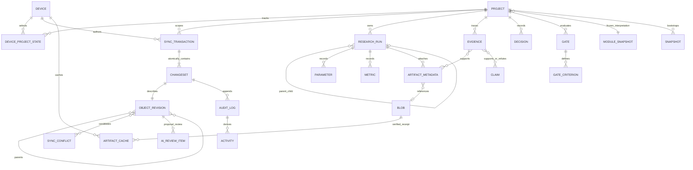

# 概念 ER（非生产 schema）

状态：**DECIDED**。DeviceProjectState、ChangeSet、Revision、Conflict、AIReviewItem 为设计实体，未创建生产表；原型表名见 prototypes/sync_sprint0。

ObjectRevision 是 Project/Run/Parameter/Metric/Artifact/Evidence/Decision/Gate/Note/Task 等业务对象的不可变版本账本，不取代各实体当前 accepted 投影。图中的 revision 自关联是 DAG 父关系，不能有环。head set、共同祖先、冲突候选均需保存；关系数量与 Human 权限仍由各 schema 校验。

Blob 去重 key 为 project+key_epoch+content locator；metadata 保留 Run 与来源。SyncTransaction 只属于一个项目；Project module_snapshot 是冻结内容，不能因远端 registry 更新重解释。生命周期 tombstone 跟对象身份保存，purge 流程不通过普通 ChangeSet。SyncConflict 与 AIReviewItem 可同时指向 revision，却要求不同的审批依据。
