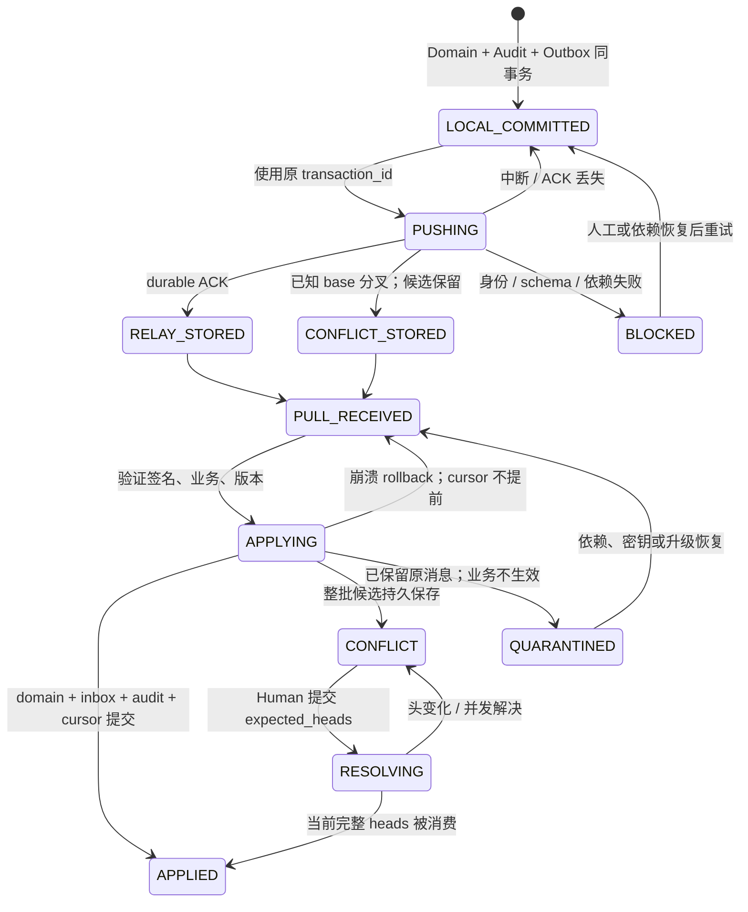

# 同步状态机

状态：**DECIDED**；其中明文 SQLite outbox/inbox、原子 apply/retry 和冲突 head 集合 **PROTOTYPED**。

本地 saved 与 synced 两个标志必须分离。pending_change_count 为未 durable ACK 的 outbox 事务数/变化数（UI 明确单位）；last_successful_sync 仅记录当前项目 push/pull 周期已完整验证结束的本机显示时间，不是因果依据。某设备 cursor 追上 watermark 但有 conflicts/quarantine 时状态为“已接收，待审查”，不能全绿。

| 对象状态 | Domain/传输行为 |
| --- | --- |
| active | 允许业务白名单变更，仍验证权限/模块 |
| archived | 保持历史，显式 restore/unarchive 才恢复相应写权限 |
| trashed | 隐藏常规视图，保留 revisions/tombstone；旧 edit 是候选 |
| restore_candidate | 候选完整持久，等待 Human 处理，不复活 Run |
| purged | 永久 tombstone，旧 revision/restore 不可自动生效 |
| module_incompatible | 项目只读；升级或解释器更新后显式重试 |

## 文件状态与跨存储恢复

Artifact bytes：ABSENT → REQUESTED → STAGED → VERIFIED → CACHED/PRIMARY_DURABLE；校验失败到 CORRUPT，不会到 VERIFIED。metadata-only 大文件可处于 AVAILABLE_ON_PRIMARY_PC，本机 bytes 仍 ABSENT，展示需电脑在线。local_only 不因请求自动上传。

OPFS/MinIO 与 metadata DB 没有共同事务：先临时写完整 bytes 并校验，再在 DB 事务提交 ready receipt；崩溃可留 orphan 临时文件但不能留虚假 ready。DB 已提交后文件丢失需重新校验降级 ABSENT。GC 先检查元数据/receipt、未 ACK 队列及备份，不能删除仍待发送或唯一副本。

Device：UNPAIRED → PAIRING → ACTIVE → REVOKED；离线成员 epoch 旧的变化先隔离、不当作新成员自动应用。Bootstrap 用 BUILDING_SNAPSHOT → VERIFIED → ATOMIC_SWITCH → TAIL_REPLAY → READY；本地 pending 保留，损坏 snapshot 不覆盖旧 store。

UI：连接状态、待发数量、冲突数、隔离数和 bytes 可用性分开显示。恢复按钮只触发显式重试/导出/审查，不能在后台把 uncertain 变成 accepted。
