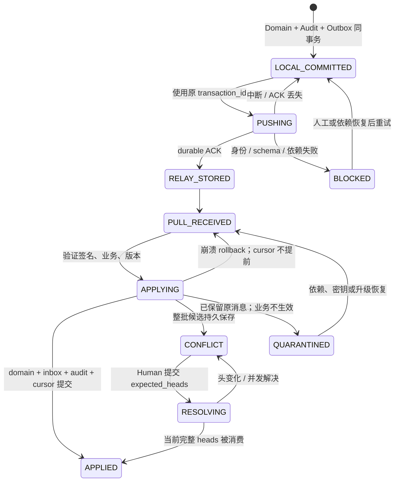

# 同步状态机

状态：Sprint1内层QA Kernel已在真实PostgreSQL验证；Sprint2已实现SecureEnvelope、可信设备生命周期、持久checkpoint与Artifact原型，以及QA HTTPS push/pull和outer cursor/Kernel同事务。最终整体验收见SPRINT_2_REPORT.md；图中完整UI、bootstrap与生产存储仍为设计。Sprint0 SQLite原型仅作历史参照。

## Sprint2 本地安全状态

会员为PENDING/ACTIVE/REVOKED，角色owner/writer/reader；PENDING没有Project Key或mutation权限，只有旧ACTIVE owner连续签名transition可正常加入。revoke/recovery永久保留旧成员与nonce prefix并轮换key epoch，REVOKED不可复活或复用prefix。

配对challenge五分钟单session、最多五次持久失败；完整证明与文本确认后，消费/会员变更/wrapped receipt同SQLite事务。再次消费拒绝，原receipt独立lookup也必须当前授权。真实presence/UI未实现。

checkpoint由显式BOOTSTRAP推进SIGNED，后续永不隐式降回初始化；持久SIGNED读取真实验签、双epoch与cursor/chain非下降。坏body/context签名或存储异常ERROR且不写入；Recovery Kit缺可信journal/head组合为RECOVERY_FRESHNESS_UNVERIFIABLE，全密钥丢失为E2E_DATA_UNRECOVERABLE。

outer transport cursor与inner received_cursor/accepted_watermark是不同水位。Task3集成整页预验并同事务更新outer与Kernel；Relay只有RELAY_STORED，其他ACK均为设备声明，不能由Relay判科学accepted。

## 已实现的 QA Kernel 状态

验证与落库处于同一个 DB 事务。新事务在内部进入 RECEIVING，成功提交为 ACCEPTED、CANDIDATE 或 QUARANTINED；异常 rollback，不存在可读的半批 RECEIVING。晚到分叉将原 ACCEPTED 批次及递归依赖改为 CANDIDATE，撤回所有成员的 accepted projection 并追加失效 Audit。完整人工解决产生新 ACCEPTED 事务，被审查的原批次进入 SUPERSEDED；依赖旧候选的派生结果仍须单独复核。

`received_cursor` 在 Inbox 与结果同事务持久后推进：ACCEPTED/CANDIDATE 路径另包含 revision/projection 判定与 Audit；QUARANTINED 只保存不可变 raw transaction/receipt，不解释业务也不生成 Domain Audit。`accepted_watermark` 是连续已完成判定（ACCEPTED/SUPERSEDED）的 receipt 水位，遇到 CANDIDATE/QUARANTINED 停止，晚到冲突可降低水位。`fully_synced` 必须同时无未决事务/冲突。重复回执保留不可变 `receipt_state`，返回的 `state` 反映当前状态，不能因旧回执曾 accepted 显示绿色。

在线 resolution 在项目行锁内核验完整当前 heads 与短期一次性 Human grant；离线 resolution 只是 proposal，可保留 RA/RB 新分叉，不完成科学确认。内层未知 schema/module hash依Sprint1保存原始消息为 QUARANTINED；外层未知协议/套件直接拒绝且不推进cursor。客户端网络ACK仅表示已持久解密receipt。通用解隔离尚未实现；高熵Kit密钥恢复与科研批次重新批准是不同操作。

## 将来的传输状态

本地 saved 与 synced 两个标志必须分离。pending_change_count 为未 durable ACK 的 outbox 事务数/变化数（UI 明确单位）；last_successful_sync 仅记录当前项目 push/pull 周期已完整验证结束的本机显示时间，不是因果依据。某设备 cursor 追上 watermark 但有 conflicts/quarantine 时状态为“已接收，待审查”，不能全绿。

| 对象状态 | Domain/传输行为 |
| --- | --- |
| active | 允许业务白名单变更，仍验证权限/模块 |
| archived | 保持历史，显式 restore/unarchive 才恢复相应写权限 |
| trashed | 隐藏常规视图，保留 revisions/tombstone；旧 edit 是候选 |
| restore_candidate | 候选完整持久，等待 Human 处理，不复活 Run |
| purged | 永久 tombstone，旧 revision/restore 不可自动生效 |
| module_incompatible | 项目只读；升级或解释器更新后显式重试 |

## 文件状态与跨存储恢复

Artifact bytes：ABSENT → REQUESTED → STAGED → VERIFIED → CACHED/PRIMARY_DURABLE；校验失败到 CORRUPT，不会到 VERIFIED。metadata-only 大文件可处于 AVAILABLE_ON_PRIMARY_PC，本机 bytes 仍 ABSENT，展示需电脑在线。local_only 不因请求自动上传。

OPFS/MinIO 与 metadata DB 没有共同事务：先临时写完整 bytes 并校验，再在 DB 事务提交 ready receipt；崩溃可留 orphan 临时文件但不能留虚假 ready。DB 已提交后文件丢失需重新校验降级 ABSENT。GC 先检查元数据/receipt、未 ACK 队列及备份，不能删除仍待发送或唯一副本。

Device：UNPAIRED → PAIRING → ACTIVE → REVOKED；离线成员 epoch 旧的变化先隔离、不当作新成员自动应用。Bootstrap 用 BUILDING_SNAPSHOT → VERIFIED → ATOMIC_SWITCH → TAIL_REPLAY → READY；本地 pending 保留，损坏 snapshot 不覆盖旧 store。

UI：连接状态、待发数量、冲突数、隔离数和 bytes 可用性分开显示。恢复按钮只触发显式重试/导出/审查，不能在后台把 uncertain 变成 accepted。
